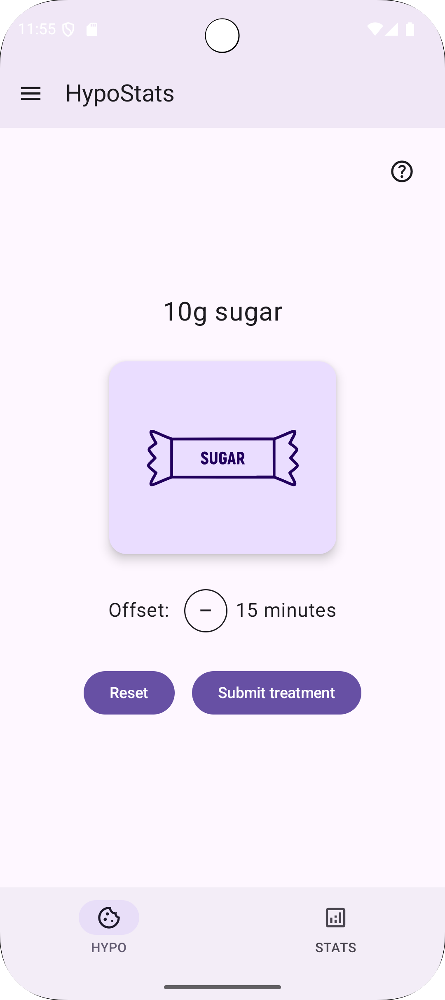
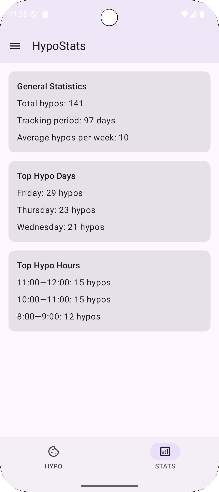
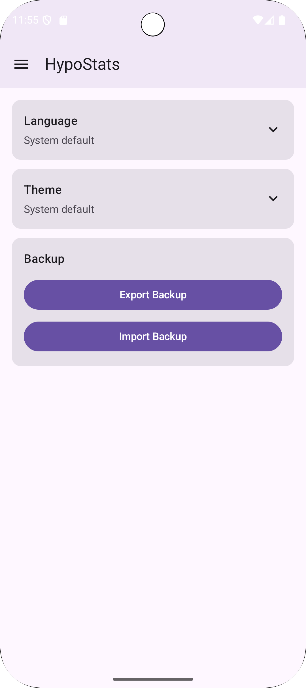

# HypoStats

A simple Android app for tracking hypoglycemic episodes.

## Features

- Record hypoglycemic treatments with sugar amounts
- View statistics and treatment history
- Backup and restore data
- Dark mode support

## Screenshots

| Submit a hypo | View stats | Settings |
|:---:|:---:|:---:|
|  |  |  |

## Requirements

- Android 8.0 (API 26) or higher

## Development

Check the [Development Guide](DEVELOPMENT.md) for build instructions, tech stack details, and CI/CD documentation.
